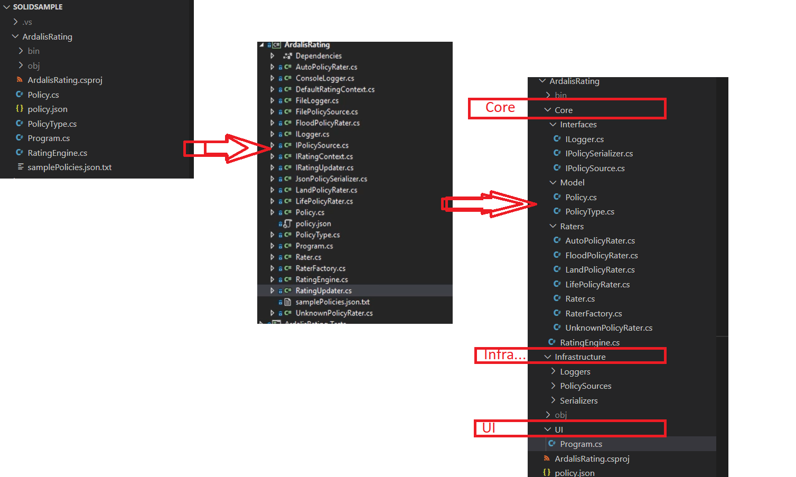

# DI - Dependency Inversion Principle

> High-level modules(business or domain modules) should not depend on low-level modules(logging or file system modules). Both should depend on abstractions.

Abstraction means:

1. Interface

2. Abstract base clases.

## How to implement DI

1.First, to make sure that your higher-level classes depend on abstractions, not implementation details. 

2.Then be sure that these abstractions don't leak details. They shouldn't care about how they're implemented. 

3.Be sure to write your classes so they are explicit about what they need, and clients should inject these classes' dependencies when they create them, perhaps using a container to help with this. 

4.Finally, use folders in an appropriately structured solution to leverage dependency inversion and produce code that's loosely coupled and easy to maintain and test. 

>

## Resources

- [Check with fiddle](https://dotnetfiddle.net/)
- [Strategy Design Pattern](https://www.tutorialspoint.com/design_pattern/strategy_pattern.htm)

### Clean Architecture References

- [Design Patterns: Elements of Reusable Object-Oriented Software](https://www.amazon.com.br/dp/0201633612/?coliid=I3BZ6YLWVQOODS&colid=33HSVS6YEB9GQ&psc=1&ref_=lv_ov_lig_dp_it_im)
- [Clean Architecture](https://www.amazon.com.br/Clean-Architecture-Craftsmans-Software-Structure/dp/0134494164/ref=pd_bxgy_img_1/146-6852552-2489063?pd_rd_w=zjy9c&pf_rd_p=4a943320-02ab-4775-ad7a-eaf57d00a244&pf_rd_r=ZKKP8CPB3JEAT1YGKPZE&pd_rd_r=6bf3a408-31a9-4080-9645-7b48a056ffa4&pd_rd_wg=NbIDx&pd_rd_i=0134494164&psc=1)
- [The Clean Architecture (The Clean Code Blog)](https://blog.cleancoder.com/uncle-bob/2012/08/13/the-clean-architecture.html)