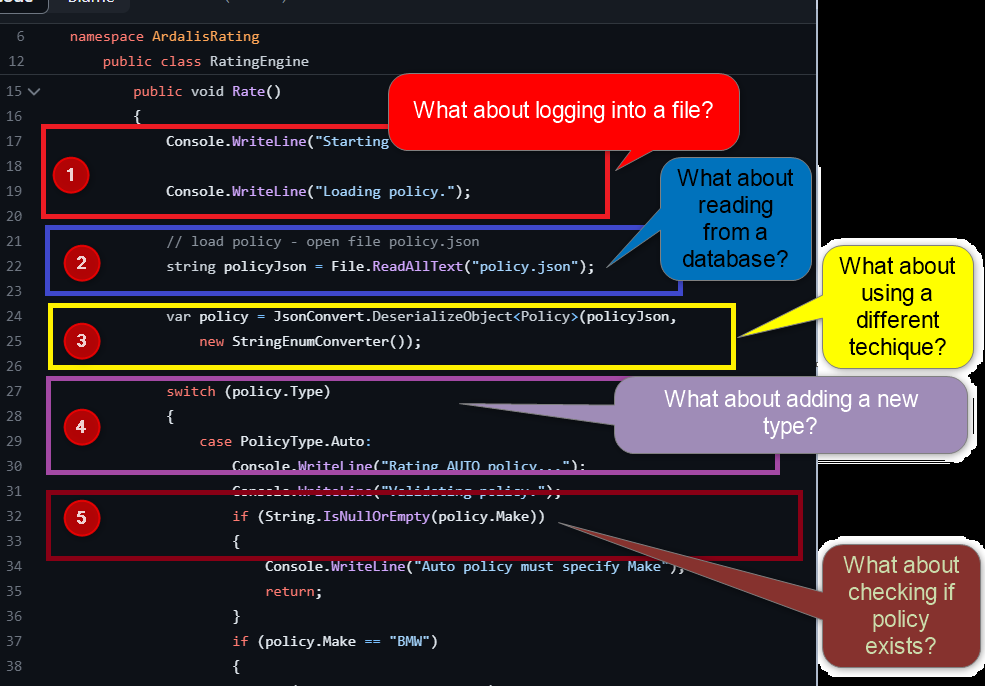
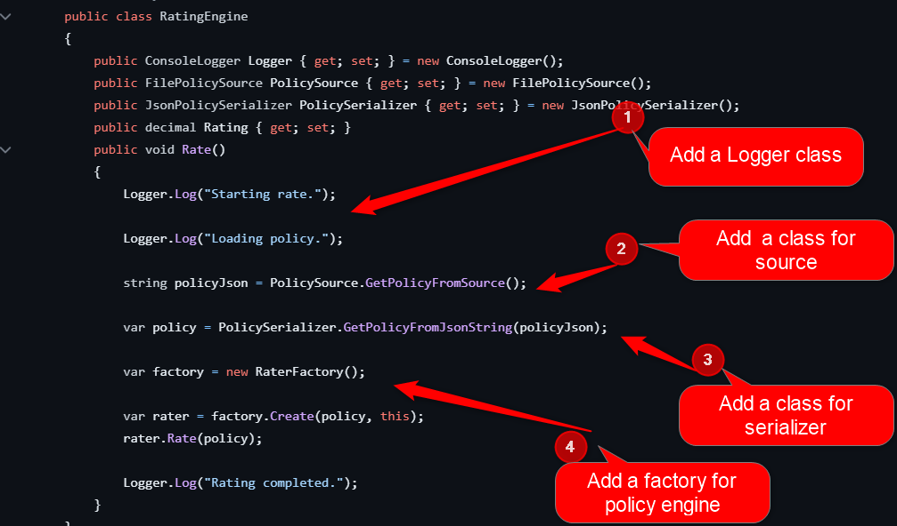

# SRP - Single Responsability Principle

> A class or function should have one and only one reason to change. 
> Has a *single responsability*.

## Definitions

### Responsabilities

- business-logic
- logging
- persistence
- validation

### Reason to change

- a rule in business logic get another option
- we want to log using a database, not only in files
- we want to persist in Cloud, not only in a database
- we want to validate more inputs not only the type of file

## How to implement SRP

### Raw implementation

```Csharp
public void Rate()
        {
            Console.WriteLine("Starting rate.");

            Console.WriteLine("Loading policy.");

            // load policy - open file policy.json
            string policyJson = File.ReadAllText("policy.json");

            var policy = JsonConvert.DeserializeObject<Policy>(policyJson,
                new StringEnumConverter());

            switch (policy.Type)
            {
                case PolicyType.Auto:
                    Console.WriteLine("Rating AUTO policy...");
                    Console.WriteLine("Validating policy.");
                    if (String.IsNullOrEmpty(policy.Make))
                    {
                        Console.WriteLine("Auto policy must specify Make");
                        return;
                    }
                    if (policy.Make == "BMW")
                    {
                        if (policy.Deductible < 500)
                        {
                            Rating = 1000m;
                        }
                        Rating = 900m;
                    }
                    break;

                case PolicyType.Land:
                    Console.WriteLine("Rating LAND policy...");
                    Console.WriteLine("Validating policy.");
                    if (policy.BondAmount == 0 || policy.Valuation == 0)
                    {
                        Console.WriteLine("Land policy must specify Bond Amount and Valuation.");
                        return;
                    }
                    if (policy.BondAmount < 0.8m * policy.Valuation)
                    {
                        Console.WriteLine("Insufficient bond amount.");
                        return;
                    }
                    Rating = policy.BondAmount * 0.05m;
                    break;

                case PolicyType.Life:
                    Console.WriteLine("Rating LIFE policy...");
                    Console.WriteLine("Validating policy.");
                    if (policy.DateOfBirth == DateTime.MinValue)
                    {
                        Console.WriteLine("Life policy must include Date of Birth.");
                        return;
                    }
                    if (policy.DateOfBirth < DateTime.Today.AddYears(-100))
                    {
                        Console.WriteLine("Centenarians are not eligible for coverage.");
                        return;
                    }
                    if (policy.Amount == 0)
                    {
                        Console.WriteLine("Life policy must include an Amount.");
                        return;
                    }
                    int age = DateTime.Today.Year - policy.DateOfBirth.Year;
                    if (policy.DateOfBirth.Month == DateTime.Today.Month &&
                        DateTime.Today.Day < policy.DateOfBirth.Day ||
                        DateTime.Today.Month < policy.DateOfBirth.Month)
                    {
                        age--;
                    }
                    decimal baseRate = policy.Amount * age / 200;
                    if (policy.IsSmoker)
                    {
                        Rating = baseRate * 2;
                        break;
                    }
                    Rating = baseRate;
                    break;

                default:
                    Console.WriteLine("Unknown policy type");
                    break;
            }

            Console.WriteLine("Rating completed.");
        }
```

### Questions?

>

### Solution

Brake the responsabilities in small pieces for logging, persistence, serialization or for business-login (rate engine);

>

## Resources

- [Check with fiddle](https://dotnetfiddle.net/)
- [Strategy Design Pattern](https://www.tutorialspoint.com/design_pattern/strategy_pattern.htm)

### Clean Architecture References

- [Design Patterns: Elements of Reusable Object-Oriented Software](https://www.amazon.com.br/dp/0201633612/?coliid=I3BZ6YLWVQOODS&colid=33HSVS6YEB9GQ&psc=1&ref_=lv_ov_lig_dp_it_im)
- [Clean Architecture](https://www.amazon.com.br/Clean-Architecture-Craftsmans-Software-Structure/dp/0134494164/ref=pd_bxgy_img_1/146-6852552-2489063?pd_rd_w=zjy9c&pf_rd_p=4a943320-02ab-4775-ad7a-eaf57d00a244&pf_rd_r=ZKKP8CPB3JEAT1YGKPZE&pd_rd_r=6bf3a408-31a9-4080-9645-7b48a056ffa4&pd_rd_wg=NbIDx&pd_rd_i=0134494164&psc=1)
- [The Clean Architecture (The Clean Code Blog)](https://blog.cleancoder.com/uncle-bob/2012/08/13/the-clean-architecture.html)
